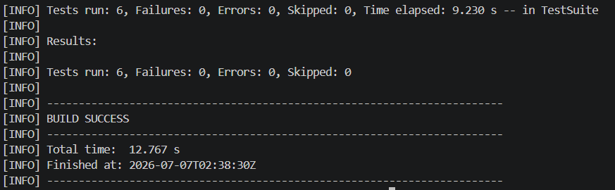

# E-Commerce SDET Automation Framework

Enterprise-style QA automation framework for an e-commerce application using **Java, Playwright, TestNG, REST Assured, JDBC, GitHub Actions, Docker, and Allure Reports**.

This project is designed as a portfolio-grade SDET framework demonstrating UI automation, API testing, database validation, reporting, CI/CD execution, Dockerized runs, and maintainable framework architecture.

## Project Purpose

The goal of this framework is to simulate how a professional QA/SDET automation project is structured in a real delivery environment.

It focuses on:

- automating critical e-commerce user journeys
- validating backend APIs
- supporting database-level checks
- generating readable test reports
- enabling CI/CD execution
- supporting Docker-based test runs
- keeping the framework maintainable and scalable

## Tech Stack

| Area | Tool / Library |
|---|---|
| Language | Java |
| UI Automation | Playwright |
| Test Runner | TestNG |
| API Testing | REST Assured |
| Database Testing | JDBC |
| Reporting | Allure Reports |
| Build Tool | Maven |
| CI/CD | GitHub Actions |
| Containerization | Docker / Docker Compose |
| Test Data | JSON, POJO, DataProvider |
| Design Pattern | Page Object Model |

## Framework Architecture

```text
                  TestNG
                    |
        +-----------+-----------+
        |           |           |
       UI          API      Database
        |           |           |
    Playwright  REST Assured   JDBC
        |           |           |
        +-----------+-----------+
             Base Framework
                    |
        Configuration / Utilities
                    |
        Allure / Logging / Docker
```

## Expected Project Structure

```text
src
├── main
│   ├── java
│   │   ├── config
│   │   ├── pages
│   │   ├── api
│   │   ├── database
│   │   ├── models
│   │   └── utils
│   └── resources
│       └── config.properties
│
├── test
│   ├── java
│   │   ├── base
│   │   ├── ui
│   │   ├── api
│   │   ├── e2e
│   │   └── database
│   └── resources
│       ├── testng.xml
│       └── test-data
│
docker
├── Dockerfile
└── docker-compose.yml

.github
└── workflows
    └── ci.yml

docs
└── screenshots
```

## Key Features

- Page Object Model for maintainable UI automation
- Playwright-based browser automation
- REST Assured API test layer
- JDBC database validation support
- Data-driven testing using JSON and POJOs
- TestNG suite execution
- Parallel execution support using ThreadLocal design
- Screenshot capture on failure
- Playwright trace support for failed UI tests
- Allure reporting integration
- GitHub Actions CI execution
- Docker and Docker Compose execution support
- Environment-based configuration

## Test Coverage

### UI Automation

Core e-commerce user flows:

- login
- registration
- logout
- product search
- add to cart
- checkout smoke flow
- validation of error messages

### API Testing

Backend validation scenarios:

- create user
- verify login
- update user
- delete user
- negative API validation
- response status and message validation

### End-to-End Testing

Example E2E flow:

```text
Create user using API
        |
Login using UI
        |
Validate user session
        |
Delete user using API
        |
Verify deleted user cannot log in
```

### Database Testing

Database validation can include:

- user record validation
- order/cart record validation
- data consistency checks
- cleanup verification

## How to Run Tests Locally

```bash
mvn clean test
```

## Run TestNG Suite

```bash
mvn clean test -DsuiteXmlFile=src/test/resources/testng.xml
```

## Run Allure Report

```bash
allure serve allure-results
```

## Docker Execution

Build the Docker image:

```bash
docker build -t ecommerce-sdet-framework .
```

Run tests inside Docker:

```bash
docker run ecommerce-sdet-framework
```

Run with Docker Compose:

```bash
docker-compose up --build
```

## GitHub Actions CI/CD

This framework is intended to support automated execution on:

- pull requests
- pushes to the main branch
- scheduled nightly regression runs

CI should execute the Maven test suite and publish test results or report artifacts.

## Reporting Screenshots

Add portfolio screenshots under:

```text
docs/screenshots/
├── allure-report.png
├── github-actions.png
├── docker-run.png
└── test-execution.png
```

Then reference them in this README:

```markdown



```

## Why This Framework Matters

This project demonstrates practical QA automation skills expected from modern QA/SDET engineers:

- framework design
- UI automation
- API automation
- database validation
- CI/CD integration
- containerized execution
- reporting and debugging
- scalable test structure

It is built to show not only that tests can be automated, but that the automation can be organized like a maintainable engineering project, which is apparently still rare enough to impress people.

## Related Freelance Service Kit

The client-facing service package for this framework is maintained separately in:

```text
qa-automation-freelance-starter
```

That repo contains service packages, outreach templates, proposal copy, and a lead tracker for turning this technical portfolio into paid QA automation work.
